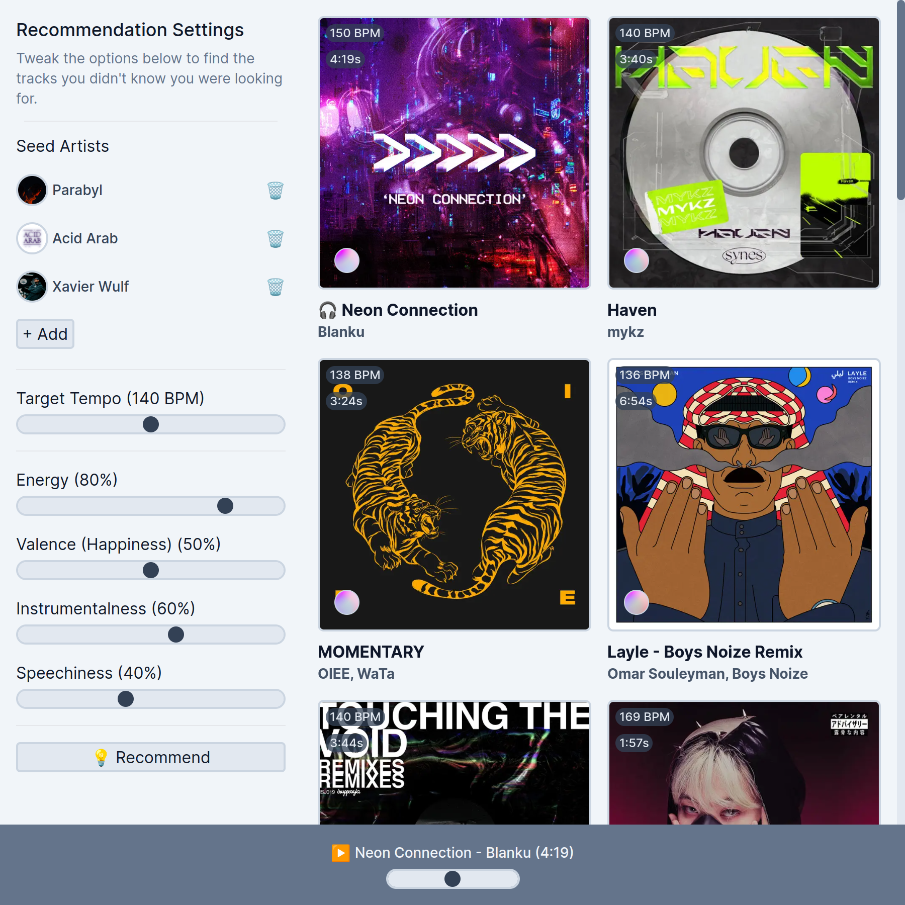

# 💽 Selecta

A Crate Digging Tool for DJs to get recommendations from Spotify.

## Project Structure

This is a Next 13 project, using the app router and hosted on Vercel. Currently I'm using Context to handle the recommendation state in the app, and talking to the API to make Spotify calls from the server.

### Contributing

You'll need a number of auth keys to contribute to the project (as listed in `.env.example`). A [Spotify Developer Account](https://developer.spotify.com/) is required, as well as a [Vercel KV Database](https://vercel.com/docs/storage/vercel-kv).

## Roadmap / Ideas

- Add Soundcloud Support
- Better Library Interaction (ie. Manage playlists from within Selecta)
- Re-do the in-app sample player

## License

Selecta is distributed under MIT license, which means you can use and modify it however you want. If you have any ideas, improvements, etc. - please feel free to make a pull request.
