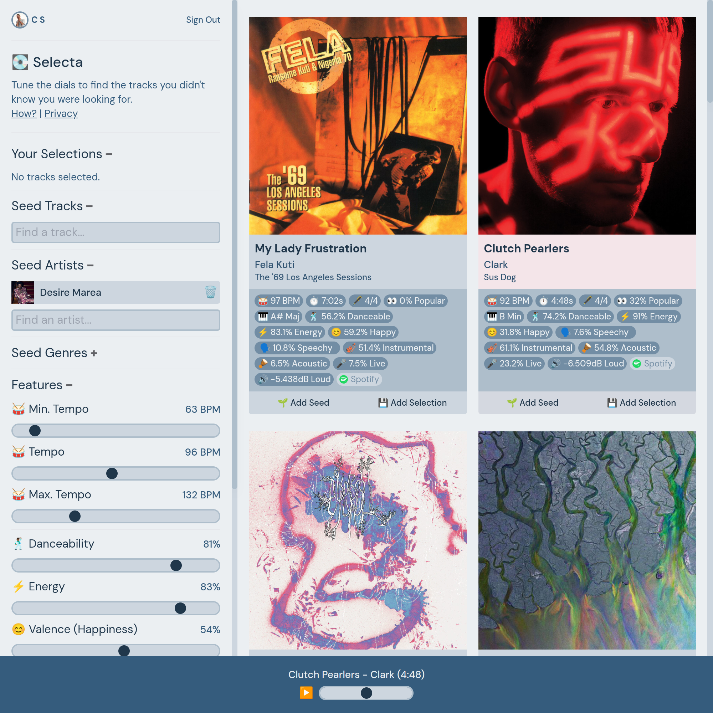

# 💽 Selecta

A Crate Digging Tool for DJs to get recommendations from Spotify.

## Project Structure

This is a Next 13 project, using the app router and hosted on Vercel. Currently I'm using Context Providers to handle the recommendation state in the app, and talking to the API to make Spotify calls from the server.

- `/src/app` - NextJS App
- `/src/app/api` - API Routes
- `/src/components` - Basic Components
- `/src/provider` - Recommendations / AudioPlayer Context
- `/src/lib` - Various re-usable code and Spotify library

## To-Do

- [ ] Add Seed Tracks Input
- [ ] Add popularity dials
- [ ] Add music features dials
- [ ] Make tracks smaller on mobile (scrollable list vs. tik-tok style)
- [ ] Skip Fwd / Bck on Audio Player
- [ ] Create "Playlist" while browsing for tracks
- [ ] Log in with Spotify
- [ ] Export tracks / playlist to profile
- [ ] Limit search by timeframe
- [ ] "Load more results" option

## License

Selecta is distributed under MIT license, which means you can use and modify it however you want. If you have any ideas, improvements, etc. - please feel free to make a pull request.

